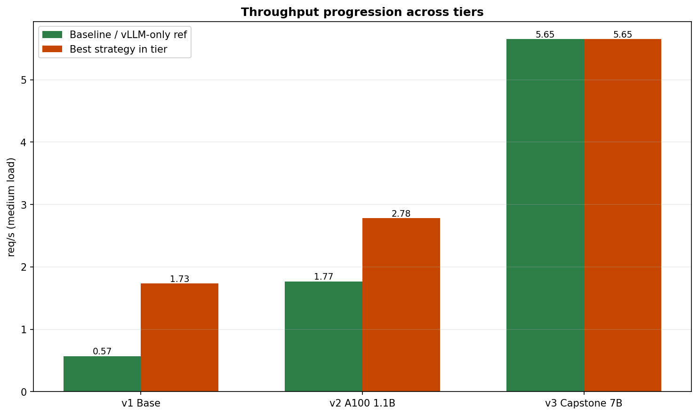

# Systems-Level Optimization of LLM Inference on a Single Consumer GPU

A reproducible benchmark lab that measures how much LLM serving throughput and tail latency can improve through **systems techniques only** — batching, scheduling, production engines, and admission control — without changing model weights.

*Collaborators: [Meghashyam](https://github.com/Meghashyam-adimallam) and [Achuth Reddy](https://github.com/AchuthReddy-16).*

---

## What this project does

Five serving backends expose `POST /generate`. We load-test them with fixed seeds, warmup passes, multi-run statistics, and `nvidia-smi` GPU traces.

| Strategy | File | Idea |
|----------|------|------|
| Baseline | `server/main.py` | One request at a time |
| Static batching | `server/batched_server.py` | Queue coalesces up to 4 requests per forward pass |
| Dynamic batching | `server/dynamic_server.py` | Async queue with a 20 ms batching window |
| vLLM | `server/vllm_server.py` | Production engine with PagedAttention |
| SLA layer | `server/sla_server.py` | vLLM + admission control (503 when p95 budget exceeded) |

**Metrics:** req/s, p50/p95/p99, tokens/s, GPU utilization (CSV).

---

## Tiers

Do not mix numbers across tiers (different GPU, model, or methodology).

| Tier | Folder | GPU | Model | Question |
|------|--------|-----|-------|----------|
| v1 | [`v1/`](v1/) | RTX 4060 8GB | TinyLlama 1.1B | Does batching help on a consumer GPU? |
| v2 | [`v2/`](v2/) | A100 40GB | TinyLlama 1.1B | Does the trend hold with 3-run mean ± std? |
| v3 | [`v3/`](v3/) | A100 40GB | Zephyr-7B-beta | vLLM vs SLA — throughput vs latency policy |

**v2 and v3 are the main evidence-backed story.** Tables below are summaries — bar charts, tail latency plots, and GPU traces are in each tier README: [`v1/README.md`](v1/README.md) · [`v2/README.md`](v2/README.md) · [`v3/README.md`](v3/README.md)

Interactive report: [`combined/tier_benchmark_report.html`](combined/tier_benchmark_report.html)



---

## v1 — Consumer GPU (RTX 4060, TinyLlama)

| Strategy | req/s | p50 (medium load) |
|----------|-------|-------------------|
| Baseline | 0.57 | 8.32 s |
| Batched | 0.71 | 6.21 s |
| Dynamic | **1.73** | **2.23 s** |

Dynamic batching reached **~3× req/s** vs baseline on the consumer GPU.


Charts: [`v1/README.md`](v1/README.md).

---

## v2 — A100 reproducibility (TinyLlama, 3-run mean ± std)

| Strategy | req/s | p50 | p95 |
|----------|-------|-----|-----|
| Baseline | 1.77 ± 0.49 | 2.70 s | 5.88 s |
| Batched | 2.29 ± 0.24 | 1.97 s | 3.90 s |
| Dynamic | **2.78 ± 0.02** | **1.96 s** | **1.98 s** |

Dynamic batching cuts p95 **5.88 s → 1.98 s** (~3×). GPU util ~27% — 1.1B cannot saturate an A100.

**Debugging note:** Early static-batching runs only batched on `/generate_batch`, not `/generate`. Fixed in `server/batched_server.py`.


Charts: [`v2/README.md`](v2/README.md).

---

## v3 — A100 capstone (Zephyr-7B-beta)

**Model:** `HuggingFaceH4/zephyr-7b-beta` (env key `zephyr-7b`). Old JSON label `mistral-7b` loaded the same Zephyr weights.

**vLLM**

| Load | req/s | p50 | p95 | fails |
|------|-------|-----|-----|-------|
| light | 4.52 | 0.44 s | 0.44 s | 0 |
| medium | **5.65** | 0.88 s | 0.89 s | 0 |
| heavy | 4.64 | 1.79 s | 1.80 s | 0 |
| long_context | 2.28 | 0.82 s | 3.52 s | 0 |

GPU util ~83–91%.

**SLA (`reject_e2e_v2`, budget p95 < 3.0 s)**

| Load | req/s | p50 | p95 | fails (503) |
|------|-------|-----|-----|-------------|
| light | 2.33 | 0.86 s | 0.86 s | 0 |
| medium | 1.16 | 2.14 s | **3.30 s** | 52 |
| heavy | 0.58 | 3.42 s | **3.43 s** | 54 |
| long_context | 0.41 | 2.83 s | **4.37 s** | 34 |

SLA cuts medium throughput **79%** (5.65 → 1.16 req/s) — that tradeoff is the point: it sheds load with HTTP **503** when the rolling e2e p95 window would breach budget. Light stays under budget; medium/heavy successful-request p95 lands at the 3.0 s ceiling. `long_context` still overshoots (4.37 s): once a request is admitted, a long generation can't be cut mid-flight.

**Debugging note:** First SLA policy only slept 50 ms on breach — never rejected (`failed: 0` while p95 hit 4–13 s). Fixed with `reject_e2e_v2`. See [`docs/v3_sla_findings.md`](docs/v3_sla_findings.md).


Charts: [`v3/README.md`](v3/README.md).

---

## Repo layout

```
server/          benchmark/     scripts/
native/          # CUDA/C++ profiler reference — kernel inventory and notes on
                 # where vLLM/PagedAttention time goes on the GPU
v1/results/  v1/report/         # RTX 4060 origin run
v2/results/  v2/report/         # TinyLlama A100 + GPU traces
v3/results/  v3/report/         # Zephyr vLLM vs SLA
combined/                        # Cross-tier summary PNGs + HTML
docs/                            # Tail latency, SLA findings, Colab guides
```

---

## Run locally

```bash
pip install -r requirements.txt

uvicorn server.main:app --host 127.0.0.1 --port 8000            # baseline
uvicorn server.batched_server:app --host 127.0.0.1 --port 8000  # static batch
uvicorn server.dynamic_server:app --host 127.0.0.1 --port 8000  # dynamic batch

python scripts/run_benchmark_suite.py \
  --url http://127.0.0.1:8000 --strategy dynamic --runs 3 --monitor-gpu

python scripts/generate_tier_charts.py
python scripts/plot_tail_latency.py --results-dir v2/results --out-dir v2/report --tier v2
python scripts/plot_tail_latency.py --results-dir v3/results --out-dir v3/report --tier v3 --strategies vllm,sla
```

vLLM and SLA need NVIDIA CUDA. vLLM is not native on macOS.

---

## Run on Colab (A100)

```bash
bash scripts/build_colab_zips.sh
```

| Tier | Notebook | Zip |
|------|----------|-----|
| v2 | `v2/colab_run_v2.ipynb` | `v2/InferenceLab_v2.zip` |
| v3 | `v3/colab_run_v3.ipynb` | `v3/InferenceLab_v3.zip` |

v3 SLA: `VLLM_MODEL=zephyr-7b`, `SLA_P95_BUDGET_SEC=3.0` — [`docs/COLAB_SLA_RERUN.md`](docs/COLAB_SLA_RERUN.md)

---

## Further reading

- [`docs/tail_latency_analysis.md`](docs/tail_latency_analysis.md) — Why p95 matters more than mean
- [`docs/v3_sla_findings.md`](docs/v3_sla_findings.md) — Broken policy vs `reject_e2e_v2`
- Profiler: `v2/results/profiles/` (Chrome trace). `v3/results/profiles/` (summary + kernel table; full Zephyr trace >100MB, not in git)
