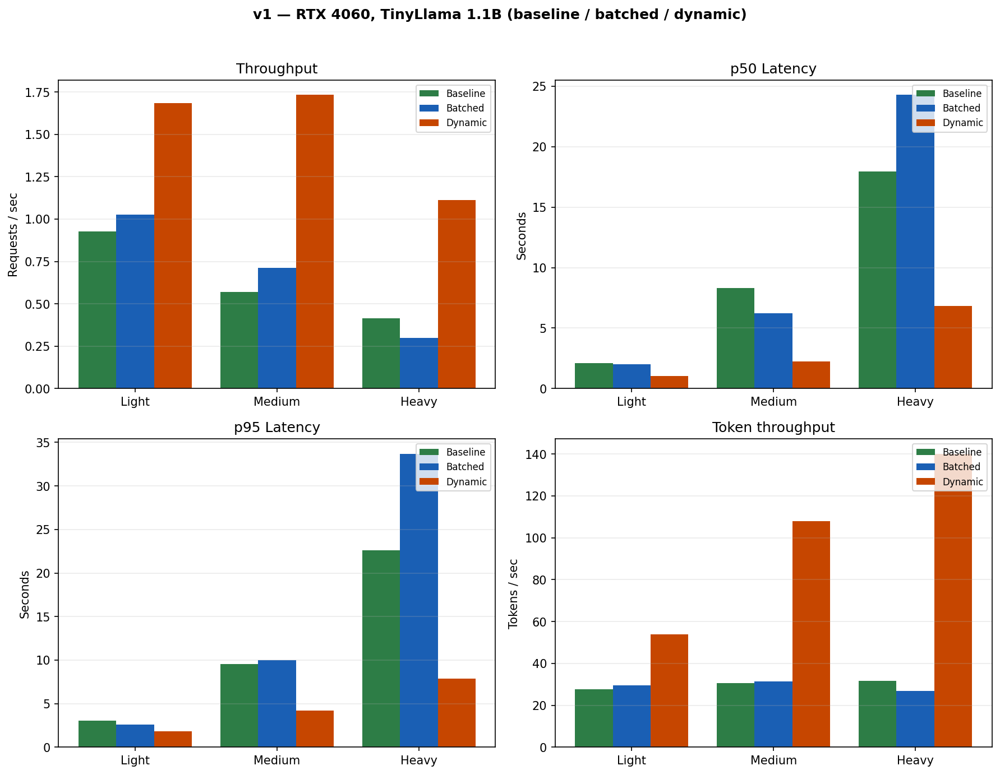
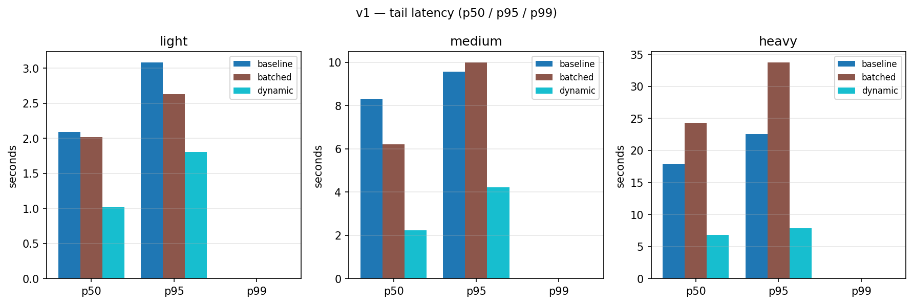
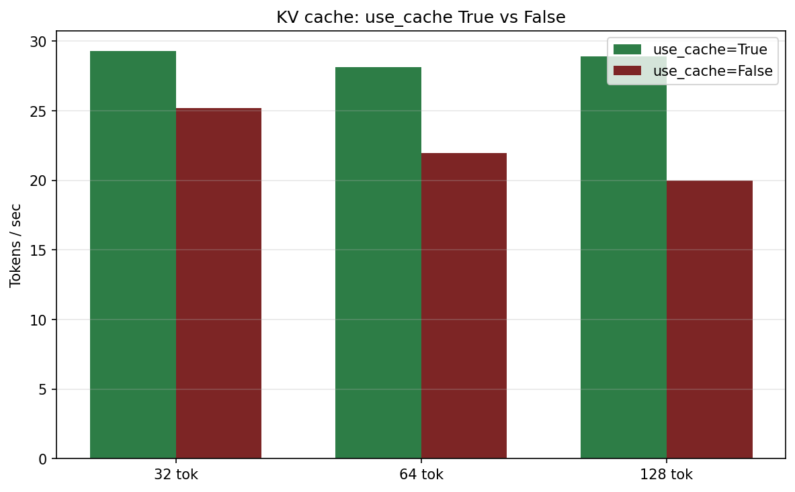

# v1 — Tier 1

**Hardware:** NVIDIA RTX 4060 Laptop, 8 GB  
**Model:** TinyLlama-1.1B  
**Strategies:** baseline, static batching, dynamic batching (hand-rolled HuggingFace servers)

## Purpose

First proof that **systems scheduling alone** improves throughput on a single consumer GPU — without changing model weights.

## Load configs

| Config | Requests | Concurrency | Max tokens |
|--------|----------|-------------|------------|
| light | 10 | 2 | 32 |
| medium | 30 | 5 | 64 |
| heavy | 30 | 8 | 128 |

## Headline numbers (medium load)

| Strategy | req/s | p50 | p95 | Source |
|----------|-------|-----|-----|--------|
| Baseline | 0.57 | 8.32 s | — | `results/load_baseline_medium_20260228_162959.json` |
| Batched | 0.71 | 6.21 s | — | `results/load_batched_medium_20260228_163851.json` |
| Dynamic | **1.73** | **2.23 s** | — | `results/load_dynamic_medium_20260228_164427.json` |

**Light load:** dynamic **1.69 req/s** vs baseline 0.93. **Heavy load:** dynamic **1.11 req/s** vs baseline 0.41.

## KV cache

`use_cache=True` gives ~16–45% higher tok/s; largest gain at 128 tokens (20.0 → 28.9 tok/s with cache on).

## Results plots

### Throughput & latency (light / medium / heavy)



### Tail latency (p50 / p95 / p99)



### KV cache (use_cache on vs off)



## What's in this folder

| Path | Contents |
|------|----------|
| `results/` | Load-test JSON + KV cache JSON |
| `report/` | Bar charts, tail latency, HTML report (`benchmark_report.html`) |

## Run locally

```bash
uvicorn server.main:app --port 8000
python scripts/run_benchmark_suite.py --url http://127.0.0.1:8000 --strategy dynamic --runs 1
```

## Regenerate charts

```bash
python scripts/generate_tier_charts.py
python scripts/plot_tail_latency.py --results-dir v1/results --out-dir v1/report --tier v1
```

See root [`README.md`](../README.md) for full project context.
