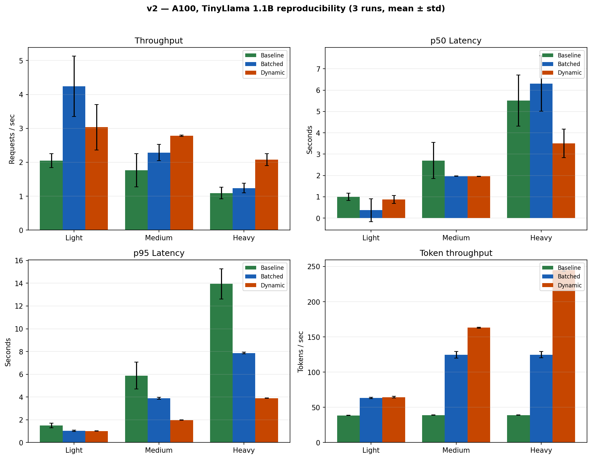
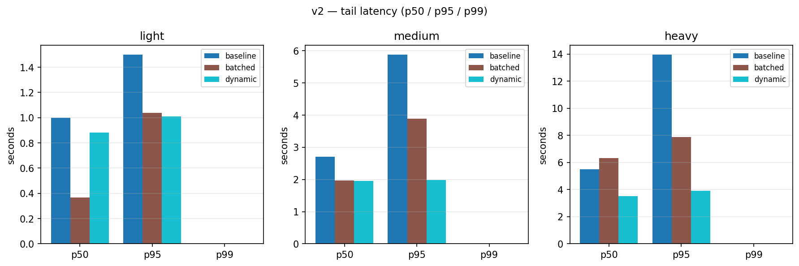
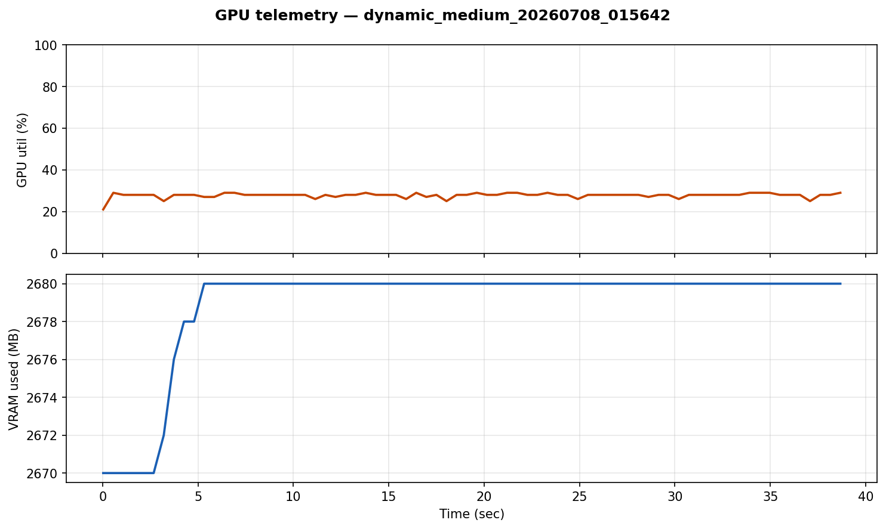

# v2 — Tier 2

**Hardware:** NVIDIA A100 40GB (Colab)  
**Model:** TinyLlama-1.1B (same weights as v1)  
**Strategies:** baseline, static batching, dynamic batching  
**Runs:** 3 per config, mean ± std, GPU CSV traces

## Purpose

Re-measure the **same three hand-rolled strategies** as v1 with proper statistics and real `nvidia-smi` traces. Validates that the batching trend holds — **not** a cross-GPU speed comparison with v1.

## Methodology

- Fixed seed, 2 warmup requests, **3 runs** per config → mean ± std
- `--monitor-gpu` → `results/gpu_traces/*.csv`
- Failure counting in load-generator JSON

## Headline numbers (medium load, mean ± std)

| Strategy | req/s | p50 | p95 | GPU util |
|----------|-------|-----|-----|----------|
| Baseline | 1.77 ± 0.49 | 2.70 s | 5.88 s | ~27% |
| Batched | 2.29 ± 0.24 | 1.97 s | 3.90 s | ~27% |
| Dynamic | **2.78 ± 0.02** | **1.96 s** | **1.98 s** | ~28% |

Dynamic cuts p95 **5.88 s → 1.98 s** (~3×) with very low variance. A100 stays ~27% utilized — 1.1B is too small to saturate the GPU. That motivated moving to 7B in v3.

**Debugging note:** Early static-batching runs only batched on `/generate_batch`, not `/generate`. Fixed in `server/batched_server.py` so `/generate` coalesces server-side.

## Results plots

### Throughput & latency (light / medium / heavy)



### Tail latency (p50 / p95 / p99)



### GPU utilization — dynamic, medium load



All GPU timelines: `report/gpu_*.png` (baseline / batched / dynamic × light / medium / heavy).

## What's in this folder

| Path | Contents |
|------|----------|
| `colab_run_v2.ipynb` | Colab notebook |
| `InferenceLab_v2.zip` | Upload package |
| `results/` | `load_*.json`, `gpu_traces/`, `profiles/` |
| `report/` | Bar charts, tail latency, GPU timelines |

## Colab

1. Runtime → A100 GPU  
2. Upload `colab_run_v2.ipynb` + `InferenceLab_v2.zip`  
3. Run all cells → download `results_and_report.zip`

## Regenerate charts

```bash
python scripts/generate_tier_charts.py
python scripts/plot_tail_latency.py --results-dir v2/results --out-dir v2/report --tier v2
```
