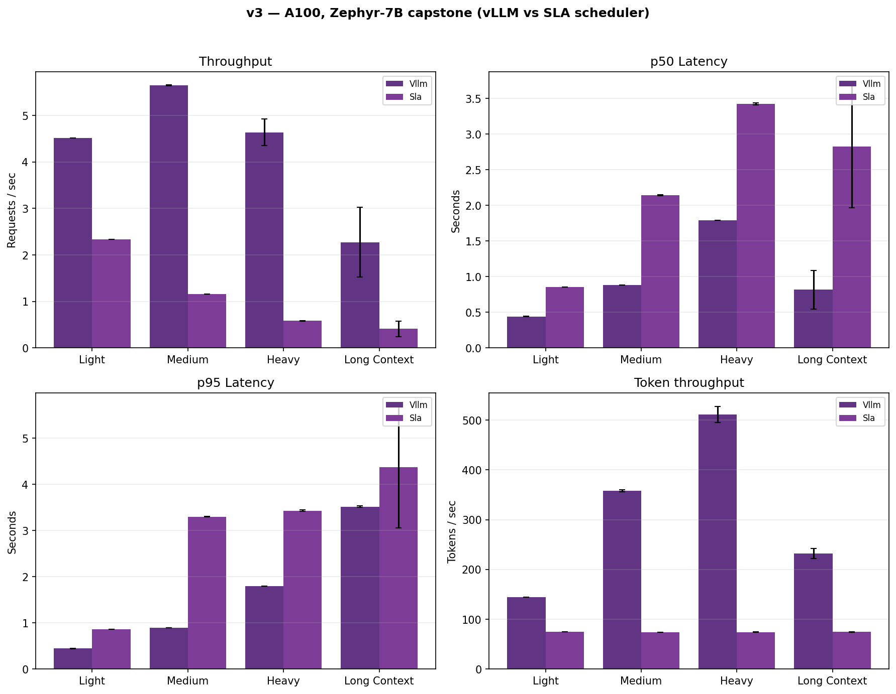
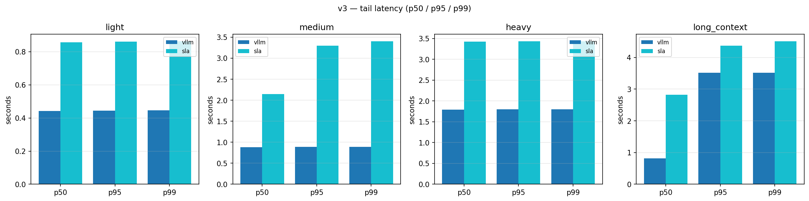
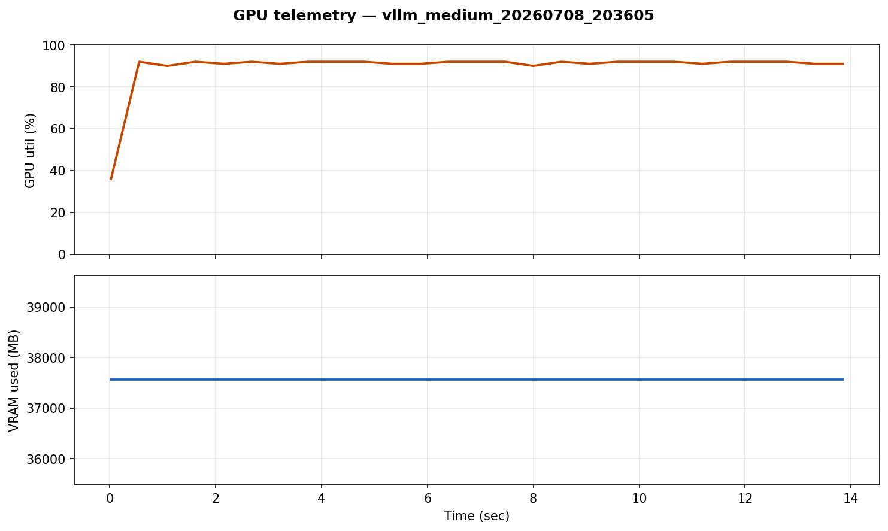
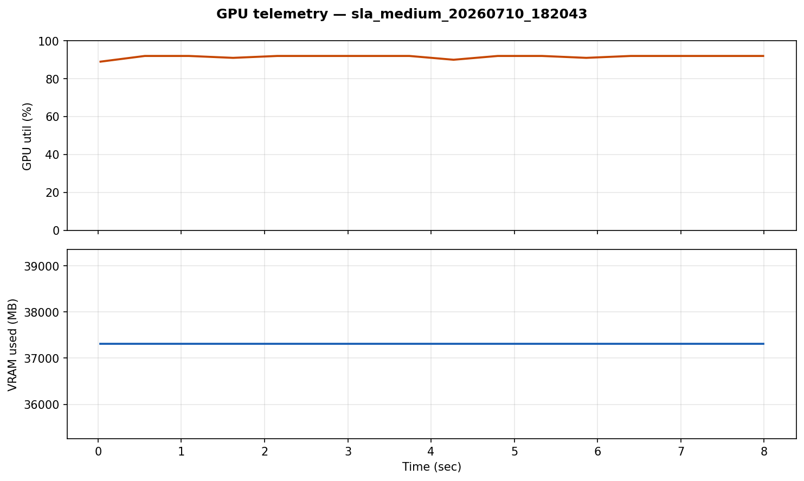

# v3 — Tier 3

**Hardware:** NVIDIA A100 40GB (Colab)  
**Model:** `HuggingFaceH4/zephyr-7b-beta` (env key `zephyr-7b`)  
**Engines:** vLLM vs SLA admission layer  
**Runs:** 2 per config + GPU CSV + profiler summary

> Old JSON labels say `mistral-7b` — that loaded **Zephyr**, not official Mistral-7B-Instruct.

## Purpose

Capstone tier: compare a **production vLLM engine** against a hand-rolled **SLA layer** (admission control on top of vLLM) on a 7B model that actually saturates the GPU.

## vLLM (raw engine)

| Load | req/s | p50 | p95 | p99 | fails |
|------|-------|-----|-----|-----|-------|
| light | 4.52 | 0.44 s | 0.44 s | 0.45 s | 0 |
| medium | **5.65** | 0.88 s | 0.89 s | 0.89 s | 0 |
| heavy | 4.64 | 1.79 s | 1.80 s | 1.80 s | 0 |
| long_context | 2.28 | 0.82 s | 3.52 s | 3.52 s | 0 |

GPU utilization ~83–91%.

## SLA (`reject_e2e_v2`, budget p95 < 3.0 s)

| Load | req/s | p50 | p95 | p99 | 503 fails |
|------|-------|-----|-----|-----|-----------|
| light | 2.33 | 0.86 s | 0.86 s | 0.86 s | 0 |
| medium | 1.16 | 2.14 s | **3.30 s** | 3.40 s | 52 |
| heavy | 0.58 | 3.42 s | **3.43 s** | 3.43 s | 54 |
| long_context | 0.41 | 2.83 s | **4.37 s** | 4.51 s | 34 |

Medium throughput drops **79%** (5.65 → 1.16 req/s) with **503 shedding** when the rolling e2e p95 window breaches budget. Light stays under budget; medium/heavy successful p95 sits at the 3.0 s ceiling. `long_context` overshoots because admitted requests cannot be cut mid-flight.

**Debugging note:** First SLA policy only slept 50 ms on breach — never rejected. Fixed with `reject_e2e_v2` (real 503 + e2e latency window). Details: [`docs/v3_sla_findings.md`](../docs/v3_sla_findings.md).

## Results plots

### Throughput & latency — vLLM vs SLA



### Tail latency — vLLM vs SLA



### GPU utilization — medium load

| vLLM | SLA |
|------|-----|
|  |  |

All GPU timelines: `report/gpu_*.png`.

## What's in this folder

| Path | Contents |
|------|----------|
| `colab_run_v3.ipynb` | Colab notebook |
| `InferenceLab_v3.zip` | Upload package |
| `results/` | vLLM + SLA JSON, `gpu_traces/`, profiler summary |
| `report/` | Bar charts, tail latency, GPU timelines |

## Colab

`colab_run_v3.ipynb` + `InferenceLab_v3.zip` — `VLLM_MODEL=zephyr-7b`, `SLA_P95_BUDGET_SEC=3.0`.  
Guide: [`docs/COLAB_SLA_RERUN.md`](../docs/COLAB_SLA_RERUN.md)

## Regenerate charts

```bash
python scripts/generate_tier_charts.py
python scripts/plot_tail_latency.py --results-dir v3/results --out-dir v3/report --tier v3 --strategies vllm,sla
```
